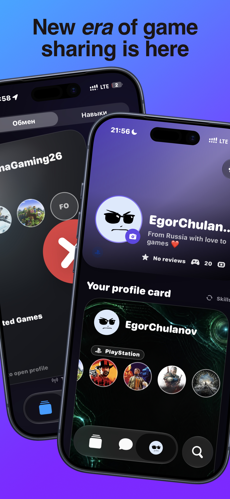
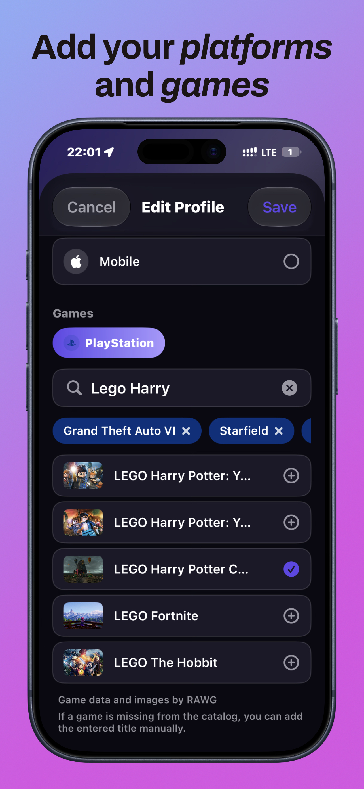
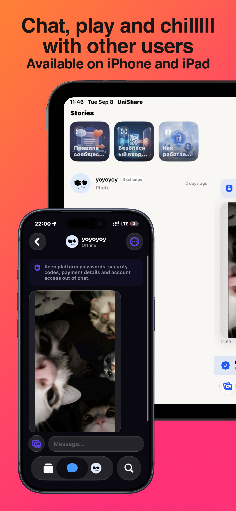
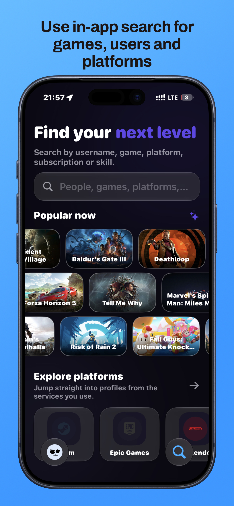
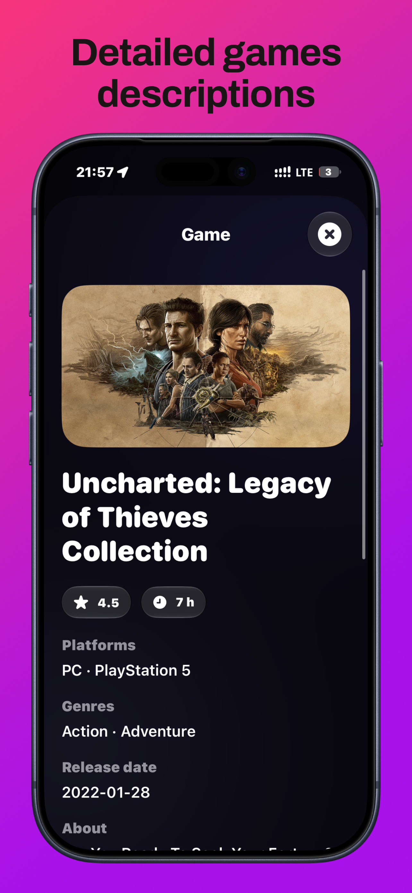
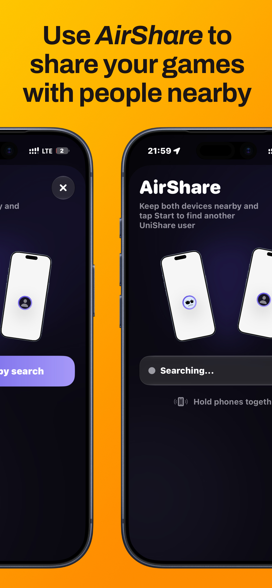

<div align="center">
  
  <h1>UniShare: Games Sharing</h1>
  <p>Социальная платформа для поиска и согласования обмена игровыми аккаунтами и библиотеками игр.</p>

  <p>
    <a href="https://github.com/EgorChulanov/UniShare/actions"></a>
    <a href="https://github.com/EgorChulanov/UniShare"></a>
    <a href="https://github.com/EgorChulanov/UniShare"></a>
  </p>
</div>

## О проекте

UniShare — нативное приложение на SwiftUI для пользователей, которые хотят найти подходящий вариант обмена игровыми аккаунтами и библиотеками игр на **PlayStation, Xbox, Nintendo, Steam, Epic Games** и других платформах. Пользователь создаёт анкету с доступными и желаемыми играми, получает рекомендации совместимых профилей, ставит лайк или дизлайк, образует взаимный match и обсуждает условия в приватном чате.

> UniShare выступает площадкой для знакомства и общения, а не продавцом или техническим посредником. Приложение не запрашивает и не хранит пароли игровых сервисов, платёжные данные или коды двухфакторной аутентификации и не выполняет передачу аккаунта за пользователя. Перед обменом пользователь обязан проверить правила соответствующей игровой платформы и самостоятельно оценить риски.

## Визуальный обзор

Ниже — рекламные mockup-карточки, подготовленные для страницы UniShare в App Store. Они показывают продукт как целостный визуальный проект, а не отдельные необработанные кадры из приложения.

<div align="center">
  
  
  
  
  
  
</div>

Исходные наборы для загрузки в App Store Connect находятся в [AppStoreScreenshots/](AppStoreScreenshots/): отдельные размеры для iPhone 6.3/6.7 и iPad 13-inch.

## Основные возможности

| Раздел | Что умеет приложение |
| --- | --- |
| **Лента** | Рекомендованные анкеты для обмена, свайпы, платформы, доступные и желаемые игры |
| **Профиль** | Анкета с аватаром, игровыми аккаунтами, библиотеками, подписками и платформами |
| **Поиск** | Поиск предложений по пользователю, игре, платформе или подписке |
| **Чаты** | Обсуждение обмена, realtime-сообщения, изображения, статусы прочтения и удаление свайпом |
| **Stories** | Квадратные community stories со слайдами и управлением через Supabase |
| **AirShare** | Опциональный обмен публичными профилями поблизости через Multipeer Connectivity |
| **Безопасность** | Жалобы, блокировка, фильтрация контента и постоянное удаление аккаунта |
| **Widgets** | Home Screen и Control Center-интеграции через App Group |
| **Локализация** | Русский, English, українська и Беларуская |

## Архитектура

```text
UniShare/
├── Core/                 # окружение, тема, локализация, haptics
├── Features/             # Auth, Onboarding, Feed, Search, Chat, AirShare, Profile
├── Models/               # профили, чаты, stories, отзывы
├── Services/             # Supabase, Storage, RAWG, push notifications
├── Cache/                # аватары, игры и пользовательские данные
├── Components/           # переиспользуемые SwiftUI-компоненты
└── Resources/            # шрифты, ассеты, App Icon

supabase/
├── migrations/           # схема, RLS, RPC и Storage policies
├── functions/            # game-search, delete-account, send-push, legal
└── seed.sql              # локальные stories и демо-данные
```

## Технологии

- Swift 5.9, SwiftUI, iOS 16.1+, iPadOS
- Supabase Auth, PostgreSQL, Realtime, Storage и Edge Functions
- Swift Package Manager и XcodeGen
- RAWG через серверный proxy/cache для игровых данных и обложек
- Multipeer Connectivity, CoreBluetooth, WidgetKit, CoreHaptics
- Manrope, Archivo Black и Plus Jakarta Sans

## Быстрый запуск

```bash
git clone https://github.com/EgorChulanov/UniShare.git
cd UniShare
make bootstrap
```

Создайте локальный `Config/Secrets.xcconfig` на основе шаблона:

```xcconfig
SUPABASE_URL = https:/$()/PROJECT_REF.supabase.co
SUPABASE_PUBLISHABLE_KEY = sb_publishable_YOUR_KEY_HERE
SUPABASE_ANON_KEY = $(SUPABASE_PUBLISHABLE_KEY)
```

В `.xcconfig` нельзя писать `https://` напрямую: `//` интерпретируется Xcode как комментарий. RAWG API key хранится только в Supabase Edge Function secret и не добавляется в приложение:

```bash
supabase secrets set RAWG_API_KEY=your_key_here
```

После выбора Development Team в Xcode:

```bash
make generate
make open
```

Подробная настройка описана в [docs/SUPABASE_SETUP.md](docs/SUPABASE_SETUP.md).

## Supabase и DataGrip

Проект содержит готовые SQL-операции для удалённой и локальной базы:

- [datagrip/00_health.sql](datagrip/00_health.sql) — проверка подключения и RLS;
- [datagrip/10_users_readonly.sql](datagrip/10_users_readonly.sql) — просмотр пользователей;
- [datagrip/21_stories_admin.sql](datagrip/21_stories_admin.sql) — создание и управление stories;
- [datagrip/30_moderation_readonly.sql](datagrip/30_moderation_readonly.sql) — жалобы и модерация;
- [datagrip/50_game_catalog_admin.sql](datagrip/50_game_catalog_admin.sql) — каталог игр;
- [datagrip/51_установить_ключ_rawg.sql](datagrip/51_установить_ключ_rawg.sql) — замена RAWG key одним SQL-скриптом.

Инструкция по подключению DataGrip и загрузке истории с фотографией: [datagrip/README.md](datagrip/README.md).

## Тестирование и CI

```bash
make test-static       # статические проверки
make test-backend      # локальные миграции и security smoke tests
make test-e2e          # детерминированный multi-user E2E
make ci-ios-tests      # unit/UI tests через xcodebuild
```

GitHub Actions проверяет проект, запускает тесты и поддерживает TestFlight-пайплайн. Секреты Supabase, App Store Connect и сертификаты должны храниться только в GitHub Environments, никогда не в исходниках.

## Backend security

- RLS включён для пользовательских таблиц и Storage;
- database password и `service_role` key не используются в iOS-клиенте;
- поиск игр выполняется через Edge Function и серверный cache;
- удаление аккаунта очищает связанные пользовательские данные;
- публичные профили не раскрывают credentials игровых сервисов.

Сводка проверки безопасности: [docs/SECURITY_REVIEW.md](docs/SECURITY_REVIEW.md).

## App Store материалы

Метаданные, локализации, privacy/support pages и release-инструкции хранятся рядом с кодом:

- [docs/APP_STORE_CONNECT_VALUES.md](docs/APP_STORE_CONNECT_VALUES.md)
- [docs/APP_STORE_RELEASE.md](docs/APP_STORE_RELEASE.md)
- [docs/privacy.html](docs/privacy.html)
- [docs/terms.html](docs/terms.html)
- [fastlane/metadata/](fastlane/metadata/)

## Статус

Проект находится в активной разработке. README отражает архитектуру и store-материалы текущей версии, но доступность отдельных backend-функций зависит от настроек Supabase проекта и секретов окружения.

## Автор

**Egor Chulanov** — iOS-разработчик и автор UniShare.

- GitHub: [@EgorChulanov](https://github.com/EgorChulanov)
- Репозиторий: [EgorChulanov/UniShare](https://github.com/EgorChulanov/UniShare)
